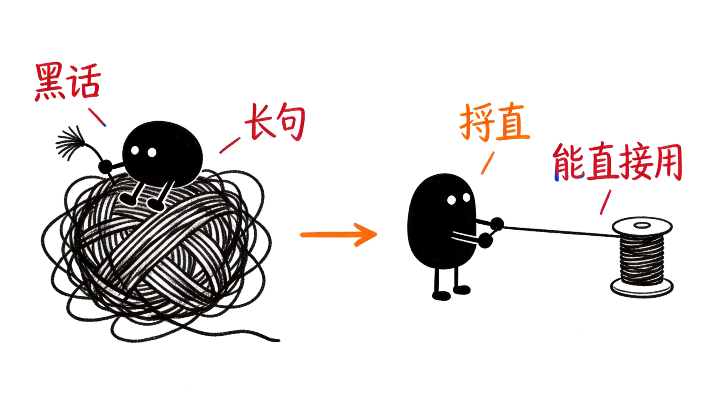
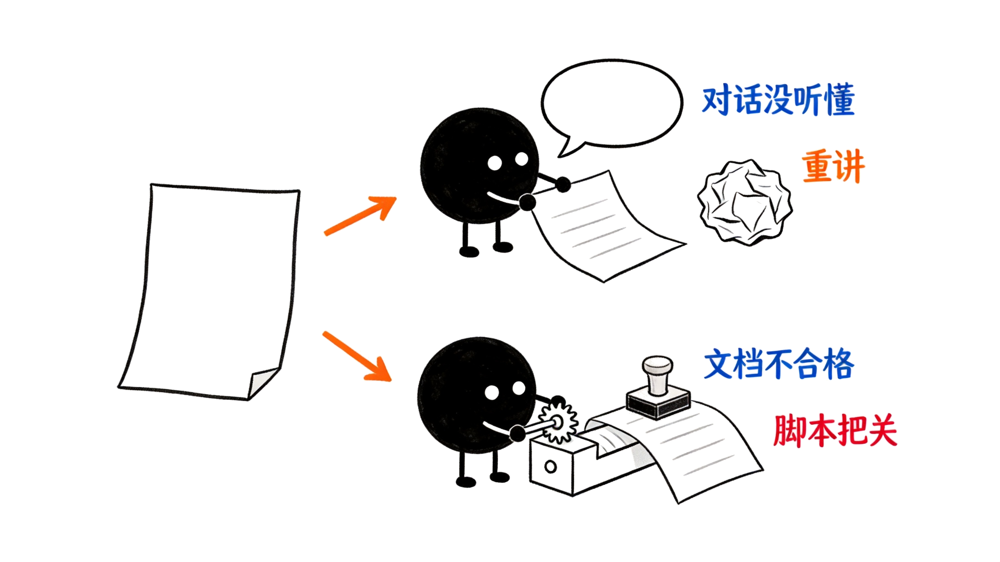
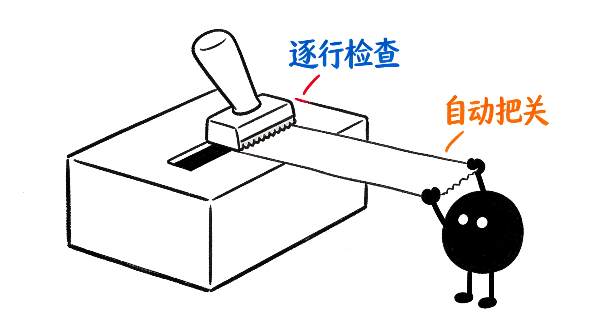

# sha-skills —— 把 AI 的输出管到能直接用

你让 AI 写文档，它交回一堆黑话和长句。你追问三次，它换个说法再说一遍。这组技能用规则和脚本管住这类输出。对话里没听懂就重讲，文档不合格就按规则重写并跑机器验证。



## 两个技能管两类表达问题

| 技能 | 什么时候用 | 怎么触发 | 做什么 |
|------|-----------|---------|--------|
| sha-plain-talk | 对话里没听懂 | 你输入 `/sha-plain-talk` | 重讲上一条回复 |
| sha-plain-docs | 文档不合格 | 模型自动触发 | 按规则重写并跑脚本验证 |

**talk 管对话**：首句给结论，最多三点支撑。不加「我已重讲」这类元注释。

**docs 管文档**：操作手册、API 说明、更新日志适用。故障排查和错误消息文案也适用。品牌文案和叙事文章不介入。



## 结构护栏管住文档骨架

docs 技能用四条护栏约束文档结构：

1. **序言只写已知**：背景与冲突先行，不引入新信息。
2. **标题是判断句**：不写「概述」「背景」这类名词标签。
3. **归纳优先不混用**：同一组内不混演绎。
4. **空壳句禁用**：不写「存在以下 N 个问题」就列条目。

## 脚本验证代替肉眼检查

`check_plain.py` 是 docs 内置的确定性 lint 脚本。检查句长、黑话、强断言来源标记、中英混排空格。标点符号与引号风格不在检查范围。半角逗号可能是源码的一部分，检查会误伤。团队于 2026-09-16 拍板删除这两类检查。

- **改写场景**：加 `--source <原稿>` 跑删改对比，检测警告词有没有被删掉。
- **绿场写作**：加 `--greenfield` 降级强断言检查，告警逐条自己复核。

违规清单按行输出。退出码 0 表示无违规，1 表示有违规，2 表示用法错误。



## 评估数据证明技能有效

评估遵循 skill-creator 的双配置对照方法。详细数据见 `docs/evals.md`。

| 技能 | with_skill | baseline | delta |
|------|-----------|----------|-------|
| sha-plain-docs | **98.5%** | 63.5% | **+0.35** |
| sha-plain-talk | 修复后 0 违规 | — | 修复验证通过 |

触发评估：docs 20/20 命中；talk 9/10，唯一误触发为「没听懂，讲清楚点」。原因已知并记录：OpenCode 不解析 `disable-model-invocation` 字段。

## 中文规则以 rules-zh.md 为权威源

中文受控写作规则只改 `references/rules-zh.md`。`docs/rules.md` 是展示副本，允许滞后。改完规则后跑脚本验证，不用肉眼比对。

## 快速开始

**装进你的环境**：

```bash
# OpenCode
ln -s ../../skills/sha-plain-talk .opencode/skills/sha-plain-talk
ln -s ../../skills/sha-plain-docs .opencode/skills/sha-plain-docs

# Claude Code
ln -s ../../skills/sha-plain-talk .claude/skills/sha-plain-talk
ln -s ../../skills/sha-plain-docs .claude/skills/sha-plain-docs
```

**使用**：

- 对话没听懂 → 输入 `/sha-plain-talk`
- 写技术文档 → sha-plain-docs 自动触发

## 目录结构

```text
skills/sha-plain-talk/         # 对话重讲技能
skills/sha-plain-docs/         # 受控文档写作技能
├── scripts/check_plain.py     # 确定性 lint 脚本
├── references/                # 中文/英文规则 + 黑话清单
└── evals/                     # 评估用例与评分标准
docs/evals.md                  # 评估结果与偏离记录
openspec/                      # 变更管理（4 个已归档 change）
```